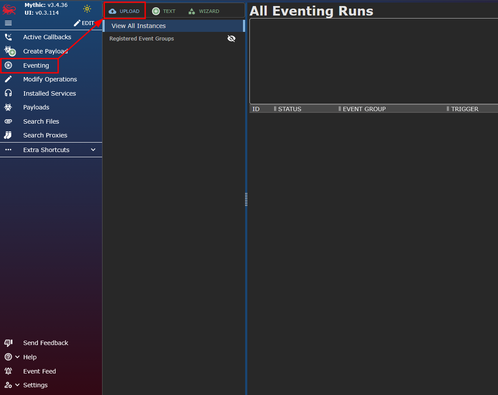
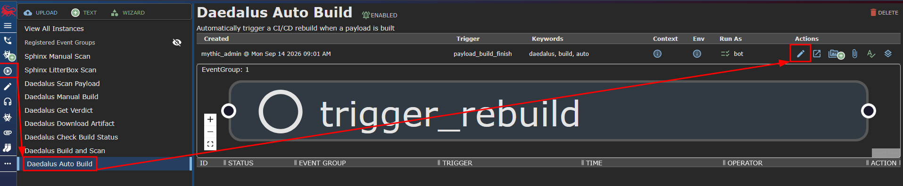
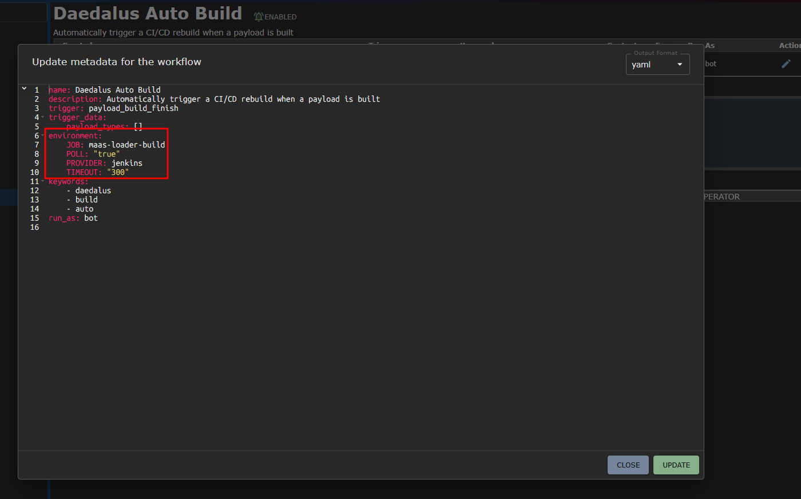

# Installation

## Prerequisites

- A running Mythic C2 instance (v3.3+)
- At least one CI/CD system accessible from the Mythic host (Jenkins, Forgejo, GitHub, GitLab, or Gitea)
- API credentials for the CI/CD system

## Install with Mythic CLI

From the Mythic install directory:

```bash
sudo ./mythic-cli install github https://github.com/Whispergate/Daedalus
```

Or install from a local path:

```bash
sudo ./mythic-cli install folder /path/to/Daedalus
```

## Configuration

### RabbitMQ

Edit `Payload_Type/daedalus/rabbitmq_config.json` before building:

```json
{
  "rabbitmq_host": "127.0.0.1",
  "rabbitmq_password": "<your-mythic-rabbitmq-password>",
  "mythic_server_host": "127.0.0.1",
  "debug_level": "warning"
}
```

The `rabbitmq_password` must match your Mythic installation's RabbitMQ password (found in your Mythic `.env` file as `RABBITMQ_PASSWORD`).

### Eventing Workflows

As of v3.3.36, the `eventingImportContainerWorkflow` mutation has a bug (`filemeta` null constraint), so workflows must be uploaded manually. After every container rebuild that changes workflow YAML files, re-upload them through the Mythic Eventing UI to update the definitions in Mythic's database.

Upload each file from `Payload_Type/daedalus/daedalus/workflows/*.yaml`:



**Note:** The `build_and_scan.yaml` workflow calls Daedalus's unified `build_and_scan` function which handles the full pipeline (build, artifact download, Mythic upload, LitterBox scan) in a single step. The `scan_payload.yaml` workflow calls Sphinx's `execute_script` function directly. If Sphinx is not available, use Daedalus's `scan_payload` custom function with `method=direct` and a `LITTERBOX_URL` instead.

### Environment Variables

Set these in Mythic's Eventing UI:




The workflows which need to have their environment variables set are:

- Daedalus Scan Payload (`LITTERBOX_URL`, `PAYLOAD_UUID`)
- Daedalus Build and Scan (`LITTERBOX_URL`, `PAYLOAD_UUID`, `LANGUAGE`)

#### General

| Variable | Default | Description |
|----------|---------|-------------|
| `DAEDALUS_PROVIDER` | `jenkins` | Default CI provider |
| `DAEDALUS_JOB` | (auto-resolved) | Default job/pipeline name. When empty, auto-resolved from the `LANGUAGE` variable as `loader-{language}` (e.g. `c-mingw` → `loader-c-mingw`) |

#### Build Parameters

These are forwarded to the CI/CD pipeline as build parameters. Daedalus does not interpret them - their meaning is defined by your pipeline's build stage.

| Variable | Default | Description |
|----------|---------|-------------|
| `LANGUAGE` | `c-mingw` | Build language/toolchain identifier. Also used for job auto-resolution (`loader-{language}`). Labyrinth standard values: `c-mingw`, `csharp`, `rust`, `go`, `nim`, `cpp-mingw`. Custom pipelines can use any value as long as a matching `loader-{value}` job exists |
| `OUTPUT_FORMAT` | `exe` | Output format passed to the pipeline. Common values: `exe` (Windows executable), `dll` (dynamic library), `bin` (raw binary/shellcode), `shellcode` (position-independent code), `svc` (Windows service executable). The pipeline's build stage interprets this value to select compiler flags and linker options |
| `OBFUSCATION` | `none` | Obfuscation profile name passed to the pipeline. The value is toolchain-specific - common values: `none` (no obfuscation), `basic` (simple transforms like string encryption), `full` (aggressive obfuscation including control flow flattening), or a named profile defined in your build scripts (e.g. `shikata`, `xor`, `aes`). Your Jenkinsfile or workflow config decides what each value does |

#### Jenkins

| Variable | Description |
|----------|-------------|
| `JENKINS_URL` | Jenkins base URL (e.g. `https://jenkins.internal:8443`) |
| `JENKINS_USER` | Jenkins API username |
| `JENKINS_TOKEN` | Jenkins API token |

#### Forgejo

| Variable | Description |
|----------|-------------|
| `FORGEJO_URL` | Forgejo base URL (e.g. `https://forgejo.internal:3000`) |
| `FORGEJO_TOKEN` | Forgejo personal access token |
| `FORGEJO_OWNER` | Default repository owner/org |
| `FORGEJO_REPO` | Default repository name |

#### GitHub

| Variable | Description |
|----------|-------------|
| `GITHUB_TOKEN` | GitHub personal access token or App token |
| `GITHUB_OWNER` | Default repository owner/org |
| `GITHUB_REPO` | Default repository name |
| `GITHUB_API_BASE` | API base URL (defaults to `https://api.github.com`; set for GitHub Enterprise) |

#### GitLab

| Variable | Description |
|----------|-------------|
| `GITLAB_URL` | GitLab base URL (e.g. `https://gitlab.internal`) |
| `GITLAB_TOKEN` | GitLab private token |
| `GITLAB_PROJECT_ID` | Default project ID (numeric) |

#### Gitea

| Variable | Description |
|----------|-------------|
| `GITEA_URL` | Gitea base URL (e.g. `https://gitea.internal:3000`) |
| `GITEA_TOKEN` | Gitea personal access token |
| `GITEA_OWNER` | Default repository owner/org |
| `GITEA_REPO` | Default repository name |

## Verify Installation

After starting Mythic with Daedalus installed:

1. Navigate to the **Eventing** page in the Mythic UI
2. You should see the seven Daedalus workflows registered
3. Edit a workflow's environment variables to set your CI/CD provider details
4. Run the **Daedalus Manual Build** workflow to test connectivity
